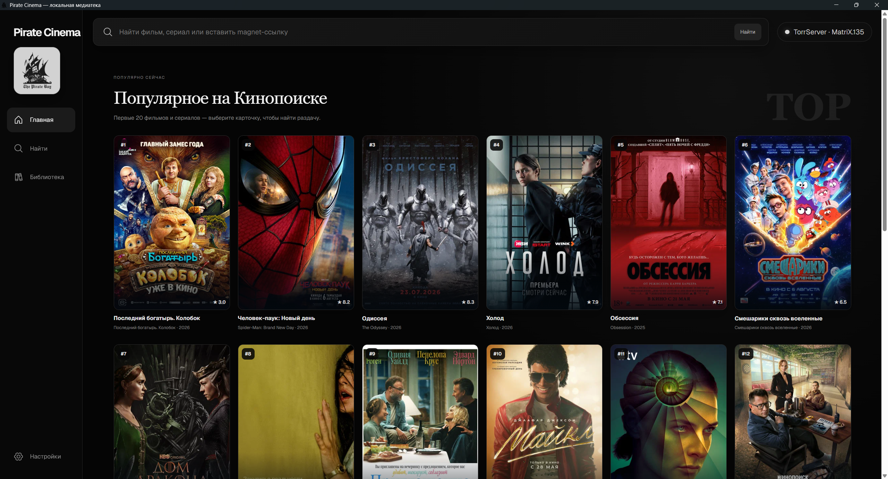

# Pirate Cinema

**Русский** · [English](#english)



Pirate Cinema — локальное настольное приложение для поиска, добавления и просмотра раздач через TorrServer. Видео открывается в MPV, а история просмотра хранится локально в SQLite.

## Возможности

- поиск раздач через локальный TorrServer;
- добавление magnet-ссылок и синхронизация медиатеки;
- постеры и описания фильмов и сериалов;
- выбор конкретного видеофайла или серии;
- воспроизведение и перемотка в MPV;
- сохранение позиции и отметки «Просмотрено» для каждого файла;
- резервное копирование и восстановление локальных данных;
- русский и английский интерфейс.

Все пользовательские данные остаются на компьютере. Новая установка запускается с пустой медиатекой TorrServer и новой пустой базой SQLite. Файл `rutor.ls` является только поисковым индексом и не содержит пользовательской медиатеки.

## Установка

Готовые файлы находятся в [последнем релизе](https://github.com/cyberboy1999/pirate-cinema/releases/latest). Сборки 0.4.4 предназначены для 64-битных систем.

### Windows 10/11

`Pirate-Cinema-Setup-0.4.4.exe` — рекомендуемый автономный установщик со встроенными MPV, FFmpeg и TorrServer. Запустите файл, подтвердите запрос Windows UAC и следуйте мастеру.

`Pirate-Cinema-Web-Setup-0.4.4.exe` — небольшой веб-установщик. Во время установки ему нужен стабильный доступ к GitHub. Если GitHub доступен только через VPN, используйте автономный установщик.

### Debian и Ubuntu

Скачайте DEB-пакет и установите:

```sh
sudo apt install ./Pirate-Cinema-0.4.4-linux-amd64.deb
```

MPV и FFmpeg будут установлены пакетным менеджером как зависимости.

### Fedora, RHEL и другие RPM-системы

```sh
sudo dnf install ./Pirate-Cinema-0.4.4-linux-x86_64.rpm
```

На системах с YUM используйте `sudo yum install ./Pirate-Cinema-0.4.4-linux-x86_64.rpm`. Файл `install-linux.sh` из релиза автоматически выбирает APT, DNF или YUM и создаёт ярлык для KDE, GNOME или XFCE.

### Arch Linux

```sh
sudo pacman -S --needed base-devel
mkdir pirate-cinema && cd pirate-cinema
curl -LO https://github.com/cyberboy1999/pirate-cinema/releases/download/v0.4.4/PKGBUILD
makepkg -si
```

Pacman установит MPV, FFmpeg и необходимые библиотеки. Ярлык появится в меню приложений KDE, GNOME или XFCE.

## Первый запуск и локальные данные

При первом запуске выберите язык и встроенный MPV либо другой локальный плеер. TorrServer запускается приложением на `http://127.0.0.1:8090`, локальный API — на `127.0.0.1:3001`. SQLite и состояние TorrServer создаются в пользовательском каталоге приложения; они не входят в установщик и не отправляются в облако.

## Запуск из исходного кода

Нужны Node.js 22+ и pnpm:

```sh
pnpm install
pnpm run dev:local
```

Проверка:

```sh
pnpm test
pnpm run lint
pnpm run build
```

Локальные переменные описаны в [`.env.example`](.env.example). Сторонние компоненты и лицензии перечислены в [`THIRD_PARTY_NOTICES.md`](THIRD_PARTY_NOTICES.md).

---

## English

Pirate Cinema is a local desktop application for searching, adding and streaming torrents through TorrServer. Video is played in MPV and per-file watch history is stored locally in SQLite.

### Features

- local TorrServer search and magnet-link import;
- synchronized library with posters and descriptions;
- movie, episode and exact-file selection;
- MPV playback with seeking;
- per-file resume position and watched state;
- local backup and restore;
- Russian and English interface.

User data stays on the computer. A fresh installation starts with empty TorrServer and SQLite libraries. The bundled `rutor.ls` file is a search index, not a user library.

### Installation

Download version 0.4.4 from the [latest release](https://github.com/cyberboy1999/pirate-cinema/releases/latest). Packages target 64-bit systems.

#### Windows 10/11

Use `Pirate-Cinema-Setup-0.4.4.exe` for the recommended offline installation. It includes MPV, FFmpeg and TorrServer. Run it, accept the Windows UAC prompt and follow the installer.

`Pirate-Cinema-Web-Setup-0.4.4.exe` is smaller but downloads the application package from GitHub. Use the offline installer when GitHub requires a VPN or the connection is unreliable.

#### Debian and Ubuntu

```sh
sudo apt install ./Pirate-Cinema-0.4.4-linux-amd64.deb
```

MPV and FFmpeg are installed as package dependencies.

#### Fedora, RHEL and other RPM systems

```sh
sudo dnf install ./Pirate-Cinema-0.4.4-linux-x86_64.rpm
```

Use YUM instead of DNF where required. The release also contains `install-linux.sh`, which selects APT, DNF or YUM and creates a KDE, GNOME or XFCE shortcut.

#### Arch Linux

```sh
sudo pacman -S --needed base-devel
mkdir pirate-cinema && cd pirate-cinema
curl -LO https://github.com/cyberboy1999/pirate-cinema/releases/download/v0.4.4/PKGBUILD
makepkg -si
```

Pacman resolves MPV, FFmpeg and desktop-library dependencies.

### First launch and local data

Select the interface language and bundled MPV or another local player. Pirate Cinema starts TorrServer at `http://127.0.0.1:8090`; its local API listens on `127.0.0.1:3001`. SQLite and TorrServer state are created in the application's user-data directory. They are not bundled or uploaded to cloud storage.

### Development

Node.js 22+ and pnpm are required:

```sh
pnpm install
pnpm run dev:local
```

```sh
pnpm test
pnpm run lint
pnpm run build
```

Local environment options are documented in [`.env.example`](.env.example). Third-party components and licenses are listed in [`THIRD_PARTY_NOTICES.md`](THIRD_PARTY_NOTICES.md).
