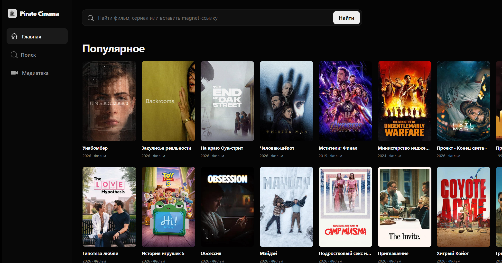

# Pirate Cinema

**Русский** · [English](#english)



Pirate Cinema — локальное настольное приложение на Rust для поиска, добавления и просмотра раздач через TorrServer. На Windows видео открывается во встроенном плеере или MPV; история каждого файла хранится локально в SQLite.

Windows-установщик включает GST-сборку TorrServer со встроенным GStreamer и Visual C++ Runtime. Отдельно устанавливать GStreamer на Windows не нужно.

## Возможности

- поиск через RuTor в TorrServer и опциональный Jackett/Prowlarr Torznab;
- добавление `magnet:`-ссылок из приложения и браузера;
- медиатека с постерами, русскими описаниями, фильтрами и сортировкой;
- выбор фильма, сезона, серии и конкретного видеофайла;
- MPV IPC: продолжение просмотра, перемотка, аудиодорожка и следующий эпизод;
- отметка «Просмотрено» при первом запуске файла;
- блок «Продолжить просмотр»;
- локальные резервные копии, диагностика, обновления и системный трей;
- русский и английский интерфейс.

Все пользовательские данные остаются на компьютере. Pirate Cinema обращается к Cinemeta, TVmaze и Wikidata только за общедоступными названиями, описаниями и изображениями; история просмотра им не передаётся.

## Как устроено приложение

- **Rust и Dioxus Desktop** — интерфейс и основная логика;
- **TorrServer GST** — локальное получение и потоковая передача торрентов;
- **встроенный плеер и MPV** — воспроизведение видео и отслеживание прогресса;
- **SQLite** — локальная история просмотра и метаданные медиатеки;
- **WebView2** — отображение интерфейса на Windows;
- **Cinemeta, TVmaze и Wikidata** — публичные описания и постеры;
- **Jackett/Prowlarr** — необязательный пользовательский источник поиска через Torznab.

```text
Dioxus UI -> Rust Core -> TorrServer -> видеопоток -> плеер
                     \-> SQLite
                     \-> сервисы метаданных
```

Windows-установщик содержит Pirate Cinema, необходимые библиотеки и только GST-версию TorrServer. Linux AppImage содержит Pirate Cinema и TorrServer, но использует системные MPV, GTK и WebKitGTK. Пользовательские базы, настройки и кэш в пакеты не входят. Лицензии комплектных компонентов находятся в [`THIRD_PARTY_NOTICES.md`](THIRD_PARTY_NOTICES.md).

## Установка

Готовые пакеты находятся в [последнем релизе](https://github.com/cyberboy1999/pirate-cinema/releases/latest). Все сборки предназначены для 64-битных систем.

### Windows 10/11

Скачайте `Pirate-Cinema-Setup-*-win-x64.exe`. Установщик обновляет существующую установку или заменяет прежнюю Electron-версию, сохраняя пользовательские данные.

### Linux AppImage

AppImage содержит Pirate Cinema и TorrServer, но использует системные MPV, GTK и WebKitGTK. Перед первым запуском установите зависимости своей системы.

Debian и Ubuntu:

```sh
sudo apt install mpv libgtk-3-0 libwebkit2gtk-4.1-0 libayatana-appindicator3-1 xdotool
```

Fedora, RHEL и совместимые системы:

```sh
sudo dnf install mpv gtk3 webkit2gtk4.1 libayatana-appindicator xdotool
```

Arch Linux и CachyOS:

```sh
sudo pacman -S --needed mpv gtk3 webkit2gtk-4.1 libayatana-appindicator xdotool
```

После установки зависимостей разрешите запуск AppImage:

```sh
chmod +x Pirate-Cinema-*-x86_64.AppImage
```

## Данные и миграция

Основной профиль Rust хранится в `%LOCALAPPDATA%\Pirate Cinema` на Windows и в `$XDG_DATA_HOME/Pirate Cinema` на Linux. При первом запуске выполняется одноразовый импорт из прежней Electron-версии и предыдущего Rust-прототипа. Импорт добавляет только отсутствующие записи и не изменяет исходные базы.

TorrServer по умолчанию доступен на `http://127.0.0.1:8090`. Приложение переиспользует уже работающий сервер либо запускает свой комплектный экземпляр и завершает только принадлежащий ему процесс.

## Сборка из исходного кода

Установите стабильный Rust toolchain и системные зависимости Dioxus Desktop, затем выполните:

```sh
cargo test --manifest-path desktop-rust/Cargo.toml
cargo clippy --manifest-path desktop-rust/Cargo.toml --all-targets -- -D warnings
cargo build --manifest-path desktop-rust/Cargo.toml --release --bin pirate-cinema
```

Сторонние компоненты и лицензии перечислены в [`THIRD_PARTY_NOTICES.md`](THIRD_PARTY_NOTICES.md).

---

## English

Pirate Cinema is a local Rust desktop application for searching, adding, and streaming torrents through TorrServer. MPV handles playback and per-file history is stored locally in SQLite.

### Features

- RuTor search through TorrServer and optional Jackett/Prowlarr Torznab;
- `magnet:` links from the application or browser;
- a poster library with descriptions, filters, and sorting;
- movie, season, episode, and exact-file selection;
- MPV IPC resume, seeking, audio-track memory, and next episode;
- launch-based Viewed markers and Continue Watching;
- local backup, diagnostics, updates, and system tray;
- Russian and English interfaces.

Playback history stays on the computer. Cinemeta, TVmaze, and Wikidata receive only public metadata queries, never the local history database.

### How the application works

- **Rust and Dioxus Desktop** provide the interface and application logic;
- **TorrServer GST** retrieves torrents locally and exposes their video streams;
- **the embedded player and MPV** play video and report playback progress;
- **SQLite** stores local playback history and library metadata;
- **WebView2** renders the interface on Windows;
- **Cinemeta, TVmaze, and Wikidata** provide public descriptions and posters;
- **Jackett/Prowlarr** is an optional user-configured search source through Torznab.

```text
Dioxus UI -> Rust Core -> TorrServer -> video stream -> player
                     \-> SQLite
                     \-> metadata services
```

The Windows installer contains Pirate Cinema, required libraries, and only the GST build of TorrServer. The Linux AppImage contains Pirate Cinema and TorrServer but uses system MPV, GTK, and WebKitGTK. User databases, preferences, and caches are never included. Bundled component licenses are listed in [`THIRD_PARTY_NOTICES.md`](THIRD_PARTY_NOTICES.md).

### Installation

Download packages from the [latest release](https://github.com/cyberboy1999/pirate-cinema/releases/latest). Builds target 64-bit systems.

#### Windows 10/11

Run `Pirate-Cinema-Setup-*-win-x64.exe`. It updates an existing installation or replaces the former Electron edition while preserving user data.

#### Linux AppImage

The AppImage contains Pirate Cinema and TorrServer but uses the system MPV, GTK, and WebKitGTK. Install the runtime for your distribution before first launch.

Debian and Ubuntu:

```sh
sudo apt install mpv libgtk-3-0 libwebkit2gtk-4.1-0 libayatana-appindicator3-1 xdotool
```

Fedora, RHEL, and compatible distributions:

```sh
sudo dnf install mpv gtk3 webkit2gtk4.1 libayatana-appindicator xdotool
```

Arch Linux and CachyOS:

```sh
sudo pacman -S --needed mpv gtk3 webkit2gtk-4.1 libayatana-appindicator xdotool
```

Then make the AppImage executable:

```sh
chmod +x Pirate-Cinema-*-x86_64.AppImage
```

### Data migration

The Rust profile lives in `%LOCALAPPDATA%\Pirate Cinema` on Windows and `$XDG_DATA_HOME/Pirate Cinema` on Linux. On first launch it performs a one-time, non-destructive import from the former Electron edition and Rust prototype. Existing source databases are never modified.

TorrServer defaults to `http://127.0.0.1:8090`. Pirate Cinema reuses an answering server or starts the bundled one and stops only the process it owns.

### Development

```sh
cargo test --manifest-path desktop-rust/Cargo.toml
cargo clippy --manifest-path desktop-rust/Cargo.toml --all-targets -- -D warnings
cargo build --manifest-path desktop-rust/Cargo.toml --release --bin pirate-cinema
```

Third-party components and licenses are listed in [`THIRD_PARTY_NOTICES.md`](THIRD_PARTY_NOTICES.md).
