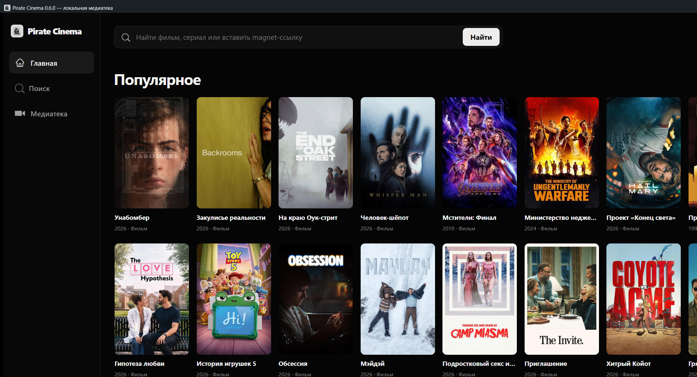

# Pirate Cinema

**Русский** · [English](#english)



Pirate Cinema — локальное настольное приложение на Rust для поиска, добавления и просмотра раздач через TorrServer. Видео открывается в MPV, а история каждого файла хранится локально в SQLite.

## Возможности

- поиск через RuTor в TorrServer и опциональный Jackett/Prowlarr Torznab;
- добавление `magnet:`-ссылок из приложения и браузера;
- медиатека с постерами, русскими описаниями, фильтрами и сортировкой;
- выбор фильма, сезона, серии и конкретного видеофайла;
- MPV IPC: продолжение просмотра, перемотка, аудиодорожка и следующий эпизод;
- отметка «Просмотрено» при первом запуске файла;
- блок «Продолжить просмотр»;
- локальные резервные копии, диагностика, обновления и системный трей;
- русский и английский интерфейс.

Все пользовательские данные остаются на компьютере. Pirate Cinema обращается к Cinemeta, Wikipedia и TVmaze только за общедоступными названиями, описаниями и изображениями; история просмотра им не передаётся.

## Как устроено приложение

- **Rust и Dioxus Desktop** — интерфейс и основная логика;
- **TorrServer GST** — локальное получение и потоковая передача торрентов;
- **MPV** — воспроизведение видео и отслеживание прогресса через IPC;
- **SQLite** — локальная история просмотра и метаданные медиатеки;
- **WebView2** — отображение интерфейса на Windows;
- **Cinemeta, Wikipedia и TVmaze** — публичные описания и постеры;
- **Jackett/Prowlarr** — необязательный пользовательский источник поиска через Torznab.

```text
Dioxus UI -> Rust Core -> TorrServer -> видеопоток -> MPV
                     \-> SQLite
                     \-> сервисы метаданных
```

Windows-установщик содержит Pirate Cinema, MPV, необходимые библиотеки и только GST-версию TorrServer. Linux-пакеты используют системные MPV и FFmpeg. Пользовательские базы, настройки и кэш в пакеты не входят. Лицензии комплектных компонентов находятся в [`THIRD_PARTY_NOTICES.md`](THIRD_PARTY_NOTICES.md).

## Установка 0.6.0

Готовые пакеты находятся в [последнем релизе](https://github.com/cyberboy1999/pirate-cinema/releases/latest). Все сборки предназначены для 64-битных систем.

### Windows 10/11

Скачайте автономный `Pirate-Cinema-Setup-0.6.0-win-x64.exe` или небольшой `Pirate-Cinema-Web-Setup-0.6.0-win-x64.exe`. Web-установщик загружает автономный пакет с GitHub, поэтому требует доступ к GitHub на протяжении установки. Установщик заменяет Electron 0.5.8, а при первом запуске Rust-версия копирует историю, настройки, постеры и локальную базу TorrServer. Исходные данные Electron не удаляются и остаются резервной копией.

### Debian и Ubuntu

```sh
sudo apt install ./Pirate-Cinema-0.6.0-linux-amd64.deb
```

### Fedora, RHEL и другие RPM-системы

```sh
sudo dnf install ./Pirate-Cinema-0.6.0-linux-x86_64.rpm
```

### Arch Linux

Скачайте `PKGBUILD` и архив из одного релиза, затем выполните `makepkg -si`. MPV и системные библиотеки устанавливаются пакетным менеджером.

## Данные и миграция

Основной профиль Rust хранится в `%LOCALAPPDATA%\Pirate Cinema` на Windows и в `$XDG_DATA_HOME/Pirate Cinema` на Linux. При первом запуске 0.6.0 выполняется одноразовый импорт из Electron 0.5.8 и предыдущего Rust-прототипа. Импорт добавляет только отсутствующие записи и не изменяет исходные базы.

TorrServer по умолчанию доступен на `http://127.0.0.1:8090`. Приложение переиспользует уже работающий сервер либо запускает свой комплектный экземпляр и завершает только принадлежащий ему процесс.

## Сборка из исходного кода

Установите стабильный Rust toolchain и системные зависимости Dioxus Desktop, затем выполните:

```sh
cargo test --manifest-path desktop-rust/Cargo.toml
cargo clippy --manifest-path desktop-rust/Cargo.toml --all-targets -- -D warnings
cargo build --manifest-path desktop-rust/Cargo.toml --release --bin pirate-cinema
```

Сторонние компоненты и лицензии перечислены в [`THIRD_PARTY_NOTICES.md`](THIRD_PARTY_NOTICES.md).

---

## English

Pirate Cinema is a local Rust desktop application for searching, adding, and streaming torrents through TorrServer. MPV handles playback and per-file history is stored locally in SQLite.

### Features

- RuTor search through TorrServer and optional Jackett/Prowlarr Torznab;
- `magnet:` links from the application or browser;
- a poster library with descriptions, filters, and sorting;
- movie, season, episode, and exact-file selection;
- MPV IPC resume, seeking, audio-track memory, and next episode;
- launch-based Viewed markers and Continue Watching;
- local backup, diagnostics, updates, and system tray;
- Russian and English interfaces.

Playback history stays on the computer. Cinemeta, Wikipedia, and TVmaze receive only public metadata queries, never the local history database.

### How the application works

- **Rust and Dioxus Desktop** provide the interface and application logic;
- **TorrServer GST** retrieves torrents locally and exposes their video streams;
- **MPV** plays video and reports progress over IPC;
- **SQLite** stores local playback history and library metadata;
- **WebView2** renders the interface on Windows;
- **Cinemeta, Wikipedia, and TVmaze** provide public descriptions and posters;
- **Jackett/Prowlarr** is an optional user-configured search source through Torznab.

```text
Dioxus UI -> Rust Core -> TorrServer -> video stream -> MPV
                     \-> SQLite
                     \-> metadata services
```

The Windows installer contains Pirate Cinema, MPV, required libraries, and only the GST build of TorrServer. Linux packages use system MPV and FFmpeg. User databases, preferences, and caches are never included. Bundled component licenses are listed in [`THIRD_PARTY_NOTICES.md`](THIRD_PARTY_NOTICES.md).

### Installing 0.6.0

Download packages from the [latest release](https://github.com/cyberboy1999/pirate-cinema/releases/latest). Builds target 64-bit systems.

#### Windows 10/11

Run the offline `Pirate-Cinema-Setup-0.6.0-win-x64.exe` or the small `Pirate-Cinema-Web-Setup-0.6.0-win-x64.exe`. The web installer downloads the offline package from GitHub and therefore needs GitHub access during installation. It replaces Electron 0.5.8. On first launch, the Rust application copies the existing history, preferences, posters, and TorrServer database. Electron source data is retained as a fallback copy.

#### Debian and Ubuntu

```sh
sudo apt install ./Pirate-Cinema-0.6.0-linux-amd64.deb
```

#### Fedora, RHEL, and other RPM systems

```sh
sudo dnf install ./Pirate-Cinema-0.6.0-linux-x86_64.rpm
```

#### Arch Linux

Download the `PKGBUILD` and source archive from the same release, then run `makepkg -si`.

### Data migration

The Rust profile lives in `%LOCALAPPDATA%\Pirate Cinema` on Windows and `$XDG_DATA_HOME/Pirate Cinema` on Linux. Version 0.6.0 performs a one-time, non-destructive import from Electron 0.5.8 and the former Rust prototype. Existing source databases are never modified.

TorrServer defaults to `http://127.0.0.1:8090`. Pirate Cinema reuses an answering server or starts the bundled one and stops only the process it owns.

### Development

```sh
cargo test --manifest-path desktop-rust/Cargo.toml
cargo clippy --manifest-path desktop-rust/Cargo.toml --all-targets -- -D warnings
cargo build --manifest-path desktop-rust/Cargo.toml --release --bin pirate-cinema
```

Third-party components and licenses are listed in [`THIRD_PARTY_NOTICES.md`](THIRD_PARTY_NOTICES.md).
